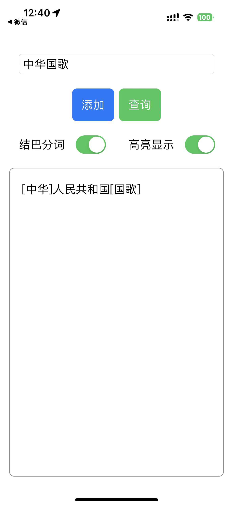

# SQLiteSwiftDemo


基于 [SQLite.swift](https://github.com/stephencelis/SQLite.swift) 和 [Simple tokenizer](https://github.com/wangfenjin/simple) 的一个demo。参考了这个 [demo](https://github.com/hxicoder/DBDemo)。


## 关键步骤

1. 修改Podfile添加依赖项

   ```ruby
     pod 'SQLite.swift', :subspecs => ['standalone'] # 不使用系统提供的SQLite
     pod 'sqlite3', :subspecs => ['fts5'] # 开启fts5
   ```

2. 拷贝FTS文件夹，添加[YourProjectName]-Bridging-Header.h，本项目是SQLiteSwiftDemo-Briging-Header.h，然后将此头文件添加到`Build Settings -> Objective-C Bridging Header`中。

剩下的可以自行阅读代码。

## 效果图

